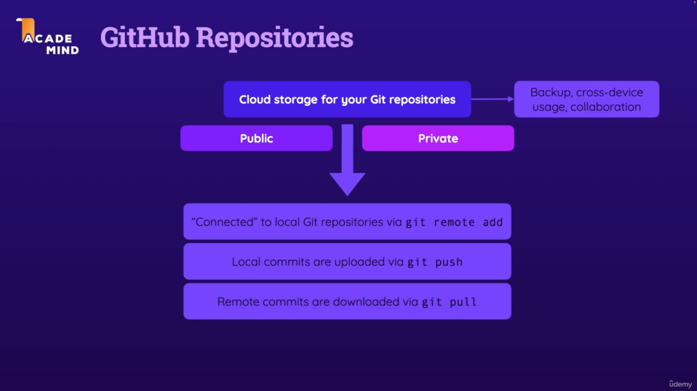

[Go back to Home](./README.md)

## 1. Checkout Branch

In the **first-project** folder:

```bash
git branch feature-restructure
git branch
git checkout feature-restructure
```

or

```bash
git checkout -b feature-restructure
```

## 2. Delete Branch

In the **first-project** folder:

```bash
git branch -D feature-restructure
```

## 3. Merge Branch

In the **first-project** folder:

```bash
git checkout main
git merge feature-restructure
```

output:

```
Merge made by the 'ort' strategy.
 BRANCH.md |  34 +++++++++++++++++++++++++++
 GIT.md    | 106 +++++++++++++++++++++++++++++++++++++++++++++++++++++++++++++++++++++++++++++++++++
 README.md | 129 +++++++++++------------------------------------------------------------------------
 3 files changed, 154 insertions(+), 115 deletions(-)
 create mode 100644 BRANCH.md
 create mode 100644 GIT.md
```

## 4. Rebase Branch

In the **first-project** folder:

```bash
git checkout -b feature-rebase
```

In the above branch make the changes save it. Then checkout the main branch:

```bash
git checkout main
```

Rebase the feature-rebase branch onto the main branch:

```bash
git rebase feature-rebase
```

output:

```
Successfully rebased and updated refs/heads/main.
```

## 5. Add Remote Repo

In the **first-project** folder:

```bash
git remote add origin git@github.com:korban910/github-crash-course-first-project.git
git branch -M main
git push -u origin main
```


