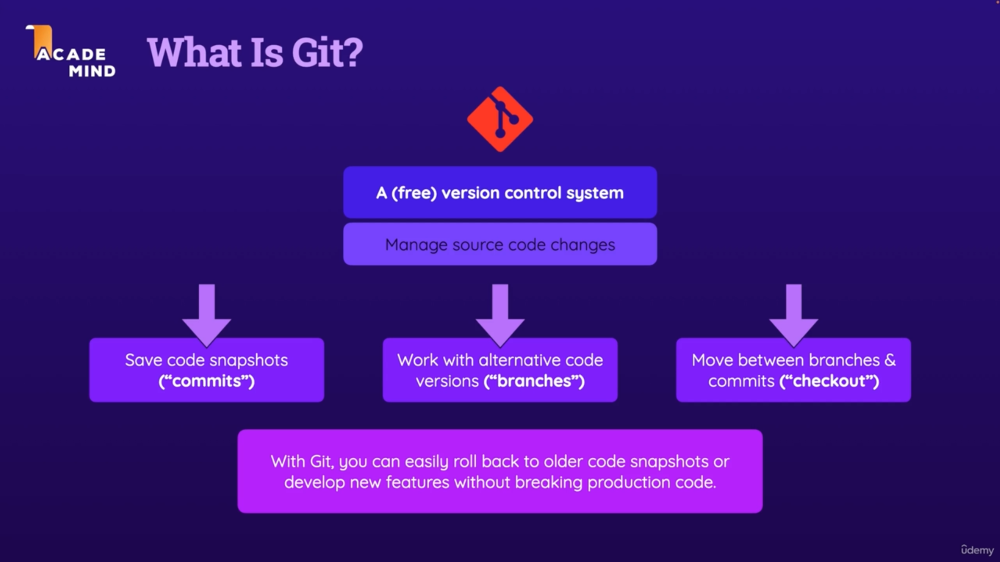
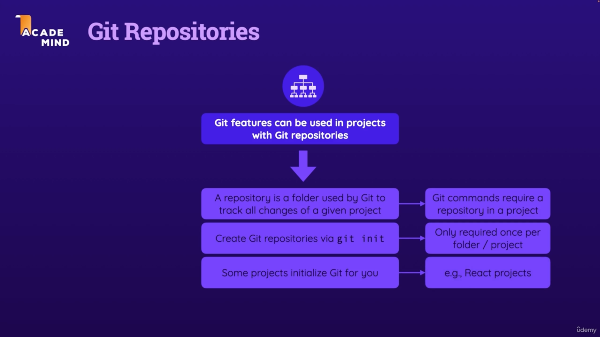
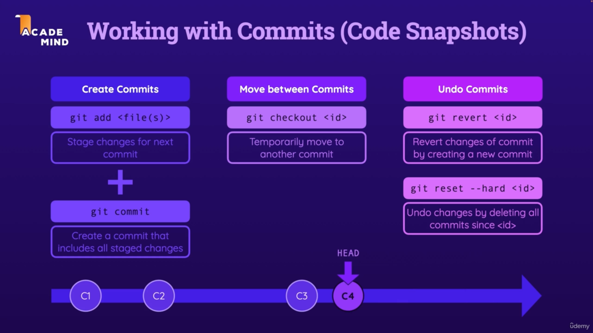
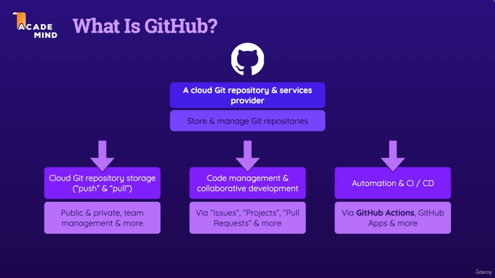
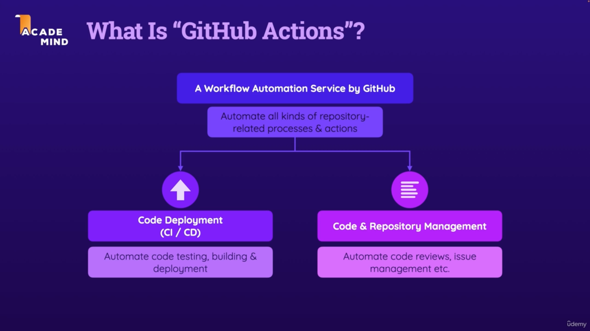
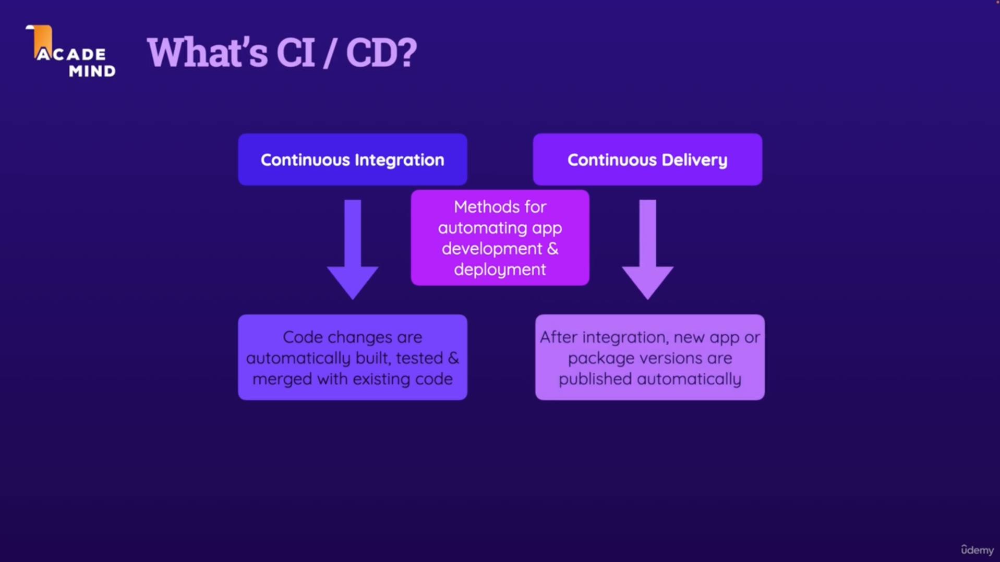

# Git & GitHub — Concept Notes

Concept learning points from the crash course. The hands-on command walkthrough is in [README.md](README.md).

## What is Git?

Git is a **(free) version control system** used to **manage source code changes**:

- **Save code snapshots** ("commits")
- **Work with alternative code versions** ("branches")
- **Move between branches & commits** ("checkout")

With Git, you can easily roll back to older code snapshots or develop new features without breaking production code.

## Git Repositories

Git features can only be used in projects that have a Git repository:

- A **repository** is a folder used by Git to track all changes of a given project — Git commands require a repository in the project.
- Create a repository with `git init` — only required **once per folder/project**.
- Some projects initialize Git for you (e.g., React projects).

## Working with Commits (Code Snapshots)

Commits form a timeline of snapshots (C1 → C2 → …), and **HEAD** points to where you currently are. Three kinds of operations:

| Goal | Command | Behavior |
| --- | --- | --- |
| **Create commits** | `git add <file(s)>` + `git commit` | Stage changes, then create a commit that includes all staged changes |
| **Move between commits** | `git checkout <id>` | Temporarily move to another commit |
| **Undo commits (safe)** | `git revert <id>` | Revert changes of a commit by creating a new commit |
| **Undo commits (destructive)** | `git reset --hard <id>` | Undo changes by deleting all commits since `<id>` |

## What is GitHub?

GitHub is a **cloud Git repository & services provider** — it stores and manages Git repositories. Three main pillars:

1. **Cloud Git repository storage** ("push" & "pull") — public & private repos, team management & more.
2. **Code management & collaborative development** — via *Issues*, *Projects*, *Pull Requests* & more.
3. **Automation & CI/CD** — via **GitHub Actions**, GitHub Apps & more.

## What is GitHub Actions?

GitHub Actions is a **workflow automation service by GitHub** — it automates all kinds of repository-related processes & actions:

- **Code deployment (CI/CD)** — automate code testing, building & deployment.
- **Code & repository management** — automate code reviews, issue management, etc.

## What's CI/CD?

CI/CD are **methods for automating app development & deployment**:

- **Continuous Integration (CI)** — code changes are automatically built, tested & merged with existing code.
- **Continuous Delivery (CD)** — after integration, new app or package versions are published automatically.
