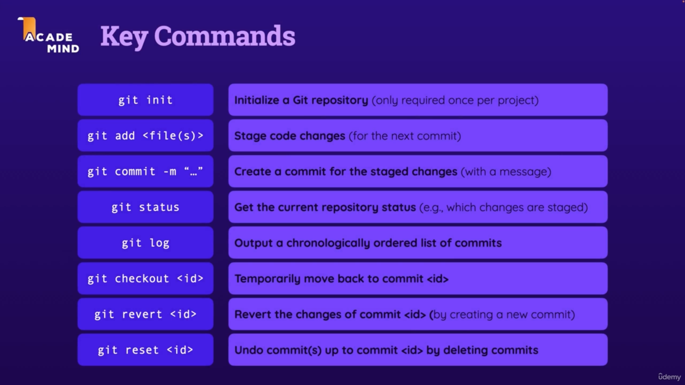
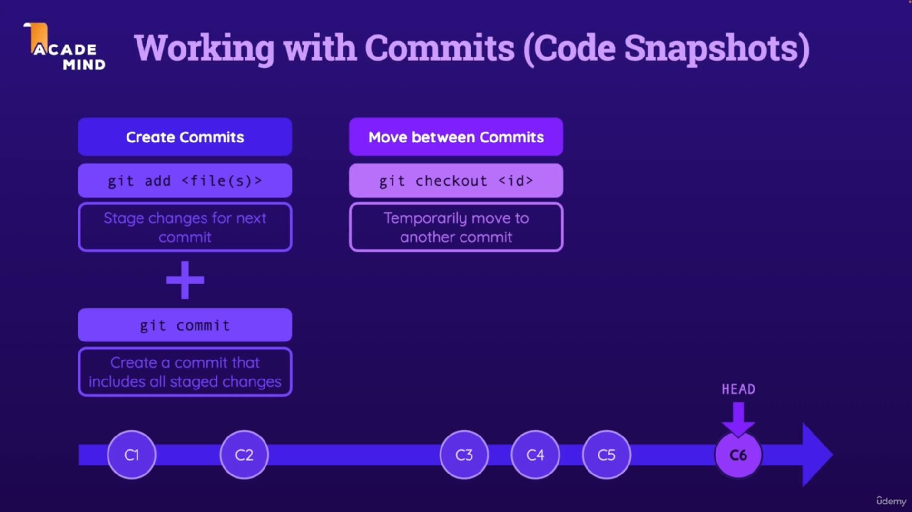
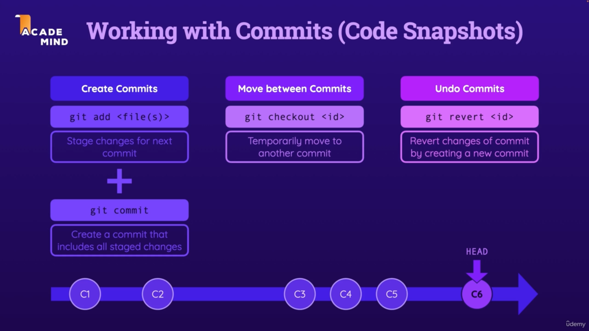

# First Project — Git & GitHub Crash Course

Hands-on practice with the core Git commands. Concept notes (What is Git/GitHub, GitHub Actions, CI/CD) live in [NOTES.md](NOTES.md).

## Key Commands



| Command | What it does |
| --- | --- |
| `git init` | Initialize a Git repository (only required once per project) |
| `git add <file(s)>` | Stage code changes (for the next commit) |
| `git commit -m "..."` | Create a commit for the staged changes (with a message) |
| `git status` | Get the current repository status (e.g., which changes are staged) |
| `git log` | Output a chronologically ordered list of commits |
| `git checkout <id>` | Temporarily move back to commit `<id>` |
| `git revert <id>` | Revert the changes of commit `<id>` (by creating a new commit) |
| `git reset <id>` | Undo commit(s) up to commit `<id>` by deleting commits |

## 1. Creating the repository and the first commit

In the **first-project** folder:

```
git init
git branch -M main
git add index.html
git commit -m "Add index.html"
```

- `git init` turns the folder into a Git repository — needed once per project.
- `git branch -M main` renames the default branch to `main`.
- `git add` **stages** changes; `git commit` saves a **snapshot** of all staged changes.



## 2. Inspecting history — `git log`

```
git log
commit 751a6b1f4b658558c70f0a2248d267fa942dbcc4 (HEAD -> main)
Author: korban <korban.torsun@gmail.com>
Date:   Tue Jul 21 17:01:19 2026 -0400

    added linked to Git docs.

commit e6153040c7669c5750712965c777a316051435da
Author: korban <korban.torsun@gmail.com>
Date:   Tue Jul 21 16:56:43 2026 -0400

    initial commit
```

- Commits are listed newest first; `HEAD -> main` marks where you currently are.
- Each commit has a unique id (hash) used by `checkout`, `revert`, and `reset`.

## 3. Moving between commits — `git checkout`

```
git checkout <commit_id>
git status
git checkout main
```

- `git checkout <commit_id>` **temporarily** moves HEAD to an older snapshot — nothing is deleted.
- `git checkout main` brings you back to the latest commit on the branch.

## 4. Undoing commits — `git revert` (safe)



```
git revert <commit_id>
git revert 751a6b1f4b658558c70f0a2248d267fa942dbcc4
```

- Revert undoes the changes of a commit **by creating a new commit** — history is preserved.

```
git log
Author: korban <korban.torsun@gmail.com>
Date:   Tue Jul 21 17:07:59 2026 -0400

    Revert "added linked to Git docs."

    This reverts commit 751a6b1f4b658558c70f0a2248d267fa942dbcc4.

commit 751a6b1f4b658558c70f0a2248d267fa942dbcc4
Author: korban <korban.torsun@gmail.com>
Date:   Tue Jul 21 17:01:19 2026 -0400

    added linked to Git docs.

commit e6153040c7669c5750712965c777a316051435da
Author: korban <korban.torsun@gmail.com>
Date:   Tue Jul 21 16:56:43 2026 -0400

    initial commit
```

Note the reverted commit is still in the log — a new "Revert" commit was added on top.

## 5. Undoing commits — `git reset --hard` (destructive)


**NOT RECOMMENDED** — reset rewrites history:

```
git reset --hard <commit_id>
git reset --hard 751a6b1f4b658558c70f0a2248d267fa942dbcc4
```

- `git reset --hard <id>` undoes changes by **deleting all commits since `<id>`** — they disappear from the log.
- Prefer `git revert` when the history matters (and always for commits already shared with others).

## Revert vs. Reset — summary

| | `git revert <id>` | `git reset --hard <id>` |
| --- | --- | --- |
| How it undoes | Adds a new commit that reverses `<id>` | Deletes all commits after `<id>` |
| History | Preserved | Rewritten (commits lost) |
| Safe to use | Yes | Not recommended |
